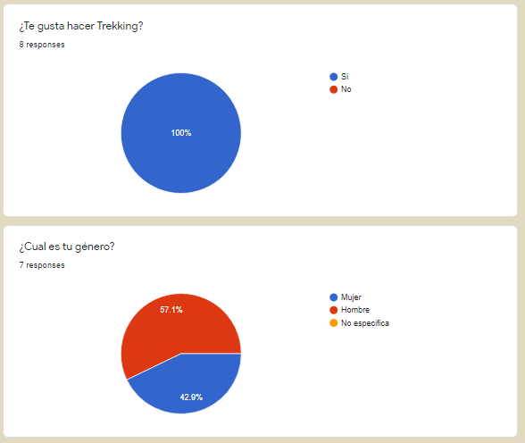
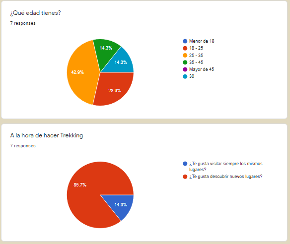
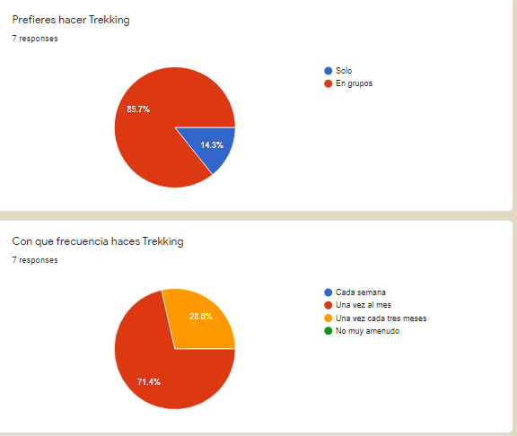
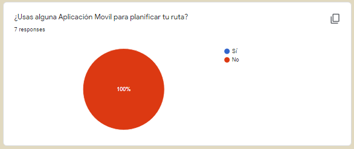
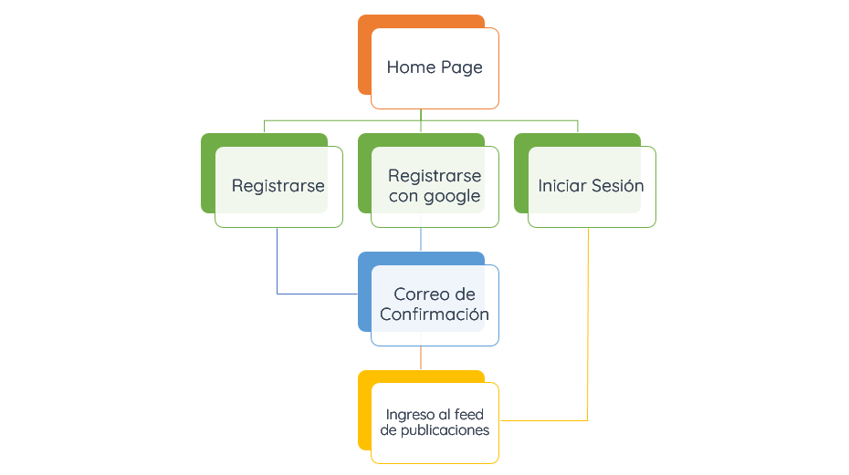
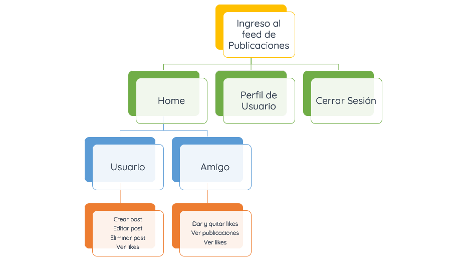
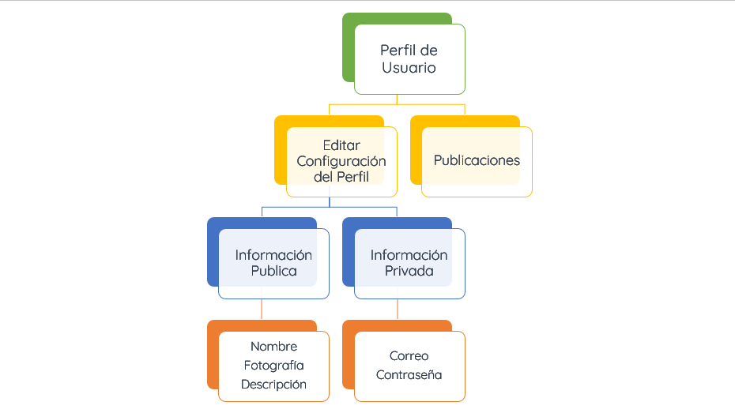
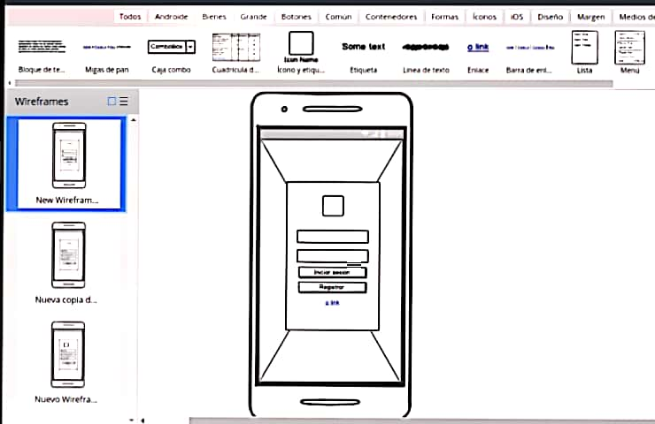
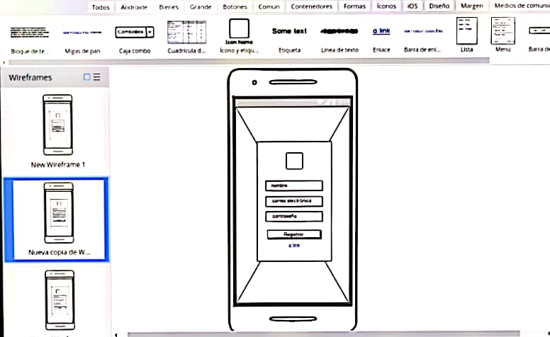
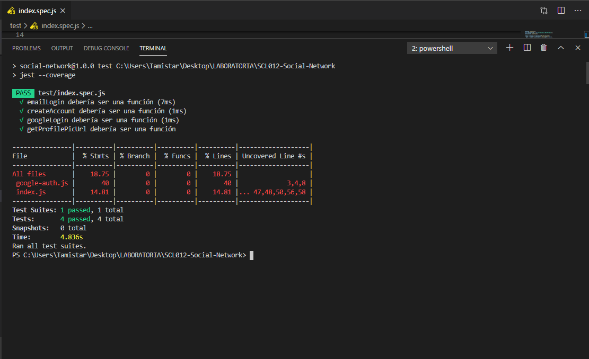

# Bitácora

## 1. Preámbulo

Instagram, Snapchat, Twitter, Facebook, Twitch, Linkedin, etc. Las redes
sociales han invadido nuestras vidas. Las amamos u odiamos, y muchos no podemos
vivir sin ellas.

Te presentamos [Bitácora](https://revaldivieso.github.io/SCL012-Social-Network/src/index.html), la nueva red social turística que despertará al explorador que todos llevamos dentro y nos acompañará a explorar nuevos lugares, llevándonos a vivir inolvidables aventuras.

* ### **1.1 Usuario**
¿Cuántas veces has estado con deseos de salir a disfrutar de un buen lugar en tu tiempo libre y te has encontrado con que:
- No conoces los lugares que se encuentran en los alrededores de tu ciudad para acampar o bien salir por el día, o simplemente hacer una caminata?.

Y cuando te decides por algún lugar...
- No tienes referencias de este; no sabes qué llevar, no tienes con quién ir o no tienes los implemenntos necesarios para tu excursión.

[Bitácora](https://revaldivieso.github.io/SCL012-Social-Network/src/index.html), es la red social que estabas esperando y que te ayudará a resolver todas las problemáticas antes mencionadas, permitiendo hacer de tus próximas salidas, en tu tiempo libre, una experiencia inolvidable.  

* ### **1.2 Problemática del Usuario**
Bitácora nace luego de detectar la necesidad, en un grupo de potenciales usuarios, de disponer de una aplicación en donde pudiesen encontrar información actualizada aportada por otros usuarios sobre excursiones en Santiago y sus alrededores.

* ### **1.3 Objetivos de la Aplicación**
- Generar un espacio de encuentro para las personas en donde puedan conocer y recomendar distintos lugares en la ciudad de Santiago y sus alrededores para realizar una excursión.
- Generar un espacio donde las personas puedan ofrecer sus servicios como guías turísticos.
- Ofrecer un espacio donde las personas puedan vender, comprar o intercambiar equipo para realizar alguna excursión.

## 2. Metodología UX
Para la definición del producto, se revisaron los siguientes sitios y aplicaciones:
- wikiloc
- alpinequest

* ### **2.1 Encuesta**

Realizamos una breve encuesta para saber si las personas que usualmente hacen trekking ocupan algun tipo de aplicación para usar en sus salidas, a continuación exponemos los resultados:

El 85% de los encuestados les gusta conocer nuevos lugares a la hora de salir hacer trekking.

Observamos que el 100% de los encuestados no han usado aplicaciones para planificar su ruta.

También puedes ver los datos actualizados en: https://docs.google.com/forms/d/1sdSzH4Mv0HbQDDVFwy5JmlW1kAy84FI4gWkH7tFyi8M/edit#responses

* ### **2.2 Historias de Usuario**

#### Historia Usuario N1
Registro con correo y contraseña

- Usuario puede registrar una cuenta con su correo electrónico y contraseña.
- El usuario puede elegir cualquier contraseña que quiera.
- Se visualizan los campos necesarios para realizar esta acción.
- En caso de contraseña no valida (menos de 6 caracteres), arroja un error.
- Correo de confirmación de cuenta creada en la aplicación.
- Los datos de registro del usuario quedan en la base de datos de Firebase.

#### Historia Usuario N2
Inicio de sesión usuario registrado

- El usuario se debe haber registrado con anterioridad en la aplicación.
- Puede acceder a la aplicación con su correo y contraseña elegidos.
- Se visualizan los campos necesarios para iniciar sesión en la aplicación.
- En caso de correo o contraseña inválidos arroja mensaje de error.
- Al iniciar sesión ingresa al "home", donde puede ver todas las publicaciones.

#### Historia Usuario N3
Acceso con Google

- El usuario puede crear una cuenta en la aplicación con su correo de google.
- Se visualiza en la pantalla de logueo un botón para registrarse con google.
- Se redirige al usuario a la página de google para que elija su correo y de acceso a la aplicación
- Los datos quedan registrados en la base de datos de Firebase.

#### Historia Usuario N4
Crear post

- Se visualizan los campos necesarios para que el usuario pueda crear un post e imprimirlo en la pantalla.
- El post le muestra al usuario lo que posteó.
- El post queda almacenado en la base de datos de Firebase.

#### Historia Usuario N5
Eliminar post

- Existe el botón de "eliminar post".
- El usuario, al querer eliminar el post, te pide confirmación de la eliminación.
- Al confirmar la eliminación el post ya no se muestra en la pantalla.
- Si se recarga la página, el post no debe estar en las publicaciones.
- Al eliminar el post, también debe borrarse de la base de datos de Firebase.

#### Historia Usuario N6
Editar post
- Existe el botón de editar post.
- Al clickear "editar", el input cambia a tipo texto.
- Al hacer click en "guardar", el input se actualiza con la nueva información.
- Si se recarga la página, debe aparecer el post editado.
- También se actualiza la información en Firebase.

#### Historia Usuario N7
Dar like a las publicaciones

- Existe el boton "like" en las publicaciones.
- Se muestra el conteo de los likes.
- Cuando no hay like, no aparece el contador.
- Los likes se suman por unidad.
- Solo se puede dar un like por usuario.
- Se elimina el like si el usuario presiona nuevamente el botón "like".

#### Historia Usuario N8
Perfil de usuario

- Existe un botón que me lleva a mi perfil de usuario.
- Se muestra una página de perfil con la información del usuario: Foto o avatar, nombre de usuario, correo, descripción.
- En el perfil se ven las publicaciones que ha hecho el usuario.
- Se puede editar la información personal del perfil.

* ### **2.3 Diagrama de Flujo**

A continuación, como decidimos que seria el diagrama de flujo de la aplicación:

* ### **2.4 Prototipos de Baja Calidad**

Prototipos en balsamiq.
#### Pagina de inicio : 

#### Pagina de registro :  

* ### **2.5 Test de Usuario**

Hacer test de usuario con Loom

## 3. Pruebas Unitarias

## 4. Futuras Mejoras
La próxima versión de Bitácora, te permitirá:

- Ofrecer tus servicios como guía a otros usuarios que los necesiten,
- Contactar a otros usuarios de la plataforma para organizar excursiones en las que podrán seleccionar un guía.
- Vender, Arrendar o intercambiar equipo para la próxima excursión.

## 5. Herramientas

Visual Studio (HTML5, CSS3, JAVASCRIPT), Firebase, Trello, Balsamiq, Formularios Google (encuesta), Loom, GitBash, GitHub, Node.js, Jest.

## 6. Desarrolladoras

- Nayarett González
- Tamara Muñoz
- Vianny Reyes

División de tareas:
- Nayarett González:  Product Owner, HTML5 JavaScript CSS3, Prototipo Baja, Readme,

- Tamara Muñoz: Scrum Master, HTML5 JavaScript CSS3, Test de Usuario, Readme,

- Vianny Reyes: Integradora, HTML5 JavaScript CSS3, Prototipo Baja Calidad, Readme, 

